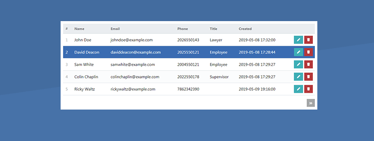

# PHP7-mini-app (CRUD application)

This is the practical week on which you are going to demonstrate all PHP7 lessons that you have learned 

helpers:

- [PHP PDO tutorial](http://zetcode.com/php/pdo/)
- [PHP PDO Tutorial: CRUD Example with MySQL](https://www.techiediaries.com/php-pdo-crud-tutorial/)


Example Preview:



## Configuration

Run `composer install` to install the project dependencies

`index.php` = The main landing page of the application

`interface/IDbCredentials.php ` = Stores the database configuration

`classes/Connection.php` = Class connection of the application

`models/Contacts.php` = The data layer of the application


###  Pre requisite

**Web Server**  
I recommend you download and install XAMPP on your local computer system, this server package includes MySQL, PHP, and the PDO extension.

**PHP7**  
I recommend you use the latest version of PHP for this crud project.

**PDO Extension**  
Should be enabled by default if you're using XAMPP, but if it's not you'll need to enable/install it.


## Design Constraints

- Bootstrap or any CSS framework you prefer, having a responsive design is a plus.


## Database  

***contacts_db***

```
CREATE TABLE IF NOT EXISTS `contacts` (
	`id` int(11) NOT NULL AUTO_INCREMENT,
  	`name` varchar(255) NOT NULL,
  	`email` varchar(255) NOT NULL,
  	`phone` varchar(255) NOT NULL,
  	`title` varchar(255) NOT NULL,
  	`created` datetime NOT NULL DEFAULT CURRENT_TIMESTAMP,
	PRIMARY KEY (`id`)
) ENGINE=InnoDB AUTO_INCREMENT=13 DEFAULT CHARSET=utf8;
```

#  Requirements

### Features

* A home Page
* A way to Login/Logout a user
* A way to display a list of contacts
* A way to CREATE,UPDATE and DELETE a contact

### Graded Requirements

* Use of PHP 7 new syntax
* Use of Polymorphism(Interface or Abtract)
* Atleast one of these methods (Overriding, Overloading or Method Chaining)
* Implementation of PDO connection class
* Implementation of namespace and autoloader class

Optional:

* Constructor Injection(Dependency injection)


